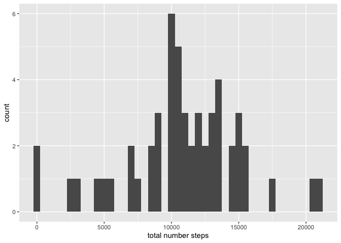

## Loading and preprocessing the data


```r
dat <- read.csv("activity.csv")
```


## What is mean total number of steps taken per day?


```r
library(tidyverse)
```

```
## ── Attaching packages ────────────────────────────────────────────────────────────── tidyverse 1.3.0 ──
```

```
## ✓ ggplot2 3.3.2     ✓ purrr   0.3.4
## ✓ tibble  3.0.3     ✓ dplyr   1.0.0
## ✓ tidyr   1.1.0     ✓ stringr 1.4.0
## ✓ readr   1.3.1     ✓ forcats 0.5.0
```

```
## ── Conflicts ───────────────────────────────────────────────────────────────── tidyverse_conflicts() ──
## x dplyr::filter() masks stats::filter()
## x dplyr::lag()    masks stats::lag()
```

```r
datgrouped <- dat %>%
  group_by(date)


  summ <- datgrouped %>% summarise(
    summ = sum(steps)
  )
```

```
## `summarise()` ungrouping output (override with `.groups` argument)
```

```r
  colnames(summ) <- c("date", "total number steps")
  
  plot1 <- ggplot(summ, aes(`total number steps`)) + 
  geom_histogram(binwidth = 500) 
  plot1
```

```
## Warning: Removed 8 rows containing non-finite values (stat_bin).
```

<!-- -->

```r
 avg <- as.integer(mean(summ$`total number steps`, na.rm = TRUE))
 me <- median(summ$`total number steps`, na.rm = TRUE)
```
The mean total number of steps taken per day is: 10766 and the median total number of steps taken per day is: 10765

## What is the average daily activity pattern?


## Imputing missing values


## Are there differences in activity patterns between weekdays and weekends?
