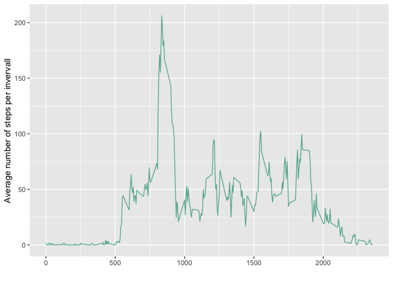
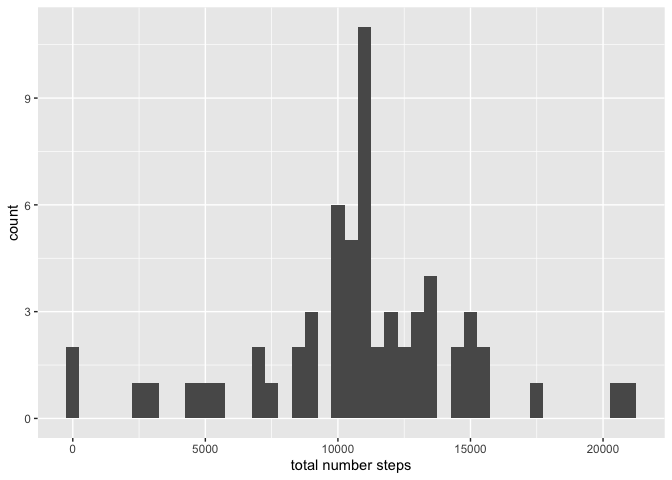
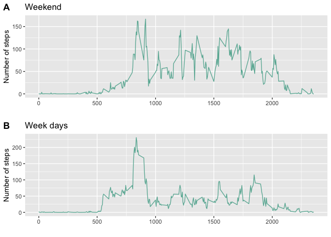

## Loading and preprocessing the data


```r
library(tidyverse)
```

```
## ── Attaching packages ──────────────────────────────────────────────────────────────────────────────────── tidyverse 1.3.0 ──
```

```
## ✓ ggplot2 3.3.2     ✓ purrr   0.3.4
## ✓ tibble  3.0.3     ✓ dplyr   1.0.0
## ✓ tidyr   1.1.0     ✓ stringr 1.4.0
## ✓ readr   1.3.1     ✓ forcats 0.5.0
```

```
## ── Conflicts ─────────────────────────────────────────────────────────────────────────────────────── tidyverse_conflicts() ──
## x dplyr::filter() masks stats::filter()
## x dplyr::lag()    masks stats::lag()
```

```r
library(ggpubr)


dat <- read.csv("activity.csv")
```


## What is mean total number of steps taken per day?


```r
datgrouped <- dat %>%
  group_by(date)


  summ <- datgrouped %>% summarise(
    summ = sum(steps)
  )
```

```
## `summarise()` ungrouping output (override with `.groups` argument)
```

```r
  colnames(summ) <- c("date", "total number steps")
  
  plot1 <- ggplot(summ, aes(`total number steps`)) + 
  geom_histogram(binwidth = 500) 
  plot1
```

```
## Warning: Removed 8 rows containing non-finite values (stat_bin).
```

<!-- -->

```r
 avg <- as.integer(mean(summ$`total number steps`, na.rm = TRUE))
 me <- median(summ$`total number steps`, na.rm = TRUE)
```
The mean total number of steps taken per day is: 10766 and the median total number of steps taken per day is: 10765

## What is the average daily activity pattern?


```r
dat2 <- dat

datgrouped2 <- dat2 %>%
  group_by(interval)


  avg2 <- datgrouped2 %>% summarise(
    mean_steps = mean(steps, na.rm = TRUE)
  )
```

```
## `summarise()` ungrouping output (override with `.groups` argument)
```

```r
p <- ggplot(avg2, aes(x=interval, y=mean_steps)) +
        geom_line(color="#69b3a2") + 
        xlab("") +
        ylab("Average number of steps per invervall")
        p
```

<!-- -->

```r
max <- avg2 %>% filter(mean_steps == max(mean_steps))
max1 <- max[[1]]
```

The 5 minute interval with the the most steps on average across all the days in the data set is: 835

## Imputing missing values


```r
#total number of missing values

mis <- is.na(dat$steps)
mis2 <- sum(mis)

#impute values

dat3 <- merge(avg2, dat, )

dat3 <- merge(dat, avg2, 
                  by.x = "interval", 
                  by.y = "interval", all = FALSE)

#new data set with imputed values
dat3$steps <- ifelse(is.na(dat3$steps), dat3$mean_steps, dat3$steps)


#plot 
dat3$date <- as.Date(dat3$date)

datgroupedIM <- dat3 %>%
  group_by(date)


  summIM <- datgroupedIM %>% summarise(
    summIM = sum(steps)
  )
```

```
## `summarise()` ungrouping output (override with `.groups` argument)
```

```r
  colnames(summIM) <- c("date", "total number steps")
  
  plot3 <- ggplot(summIM, aes(`total number steps`)) + 
  geom_histogram(binwidth = 500) 
  plot3
```

<!-- -->

```r
 avgImp <- as.integer(mean(summIM$`total number steps`))
 meImp <- as.integer(median(summIM$`total number steps`))
```

The total number of missing values in the data set is: 2304

The strategy to impute missing values will be to replace them with the global average of the same interval.

After imputing the mean total number of steps taken per day is: 10766 and the median total number of steps taken per day is: 10766. The mean values as unaffected, the median value changed from 10765 to 10766


## Are there differences in activity patterns between weekdays and weekends?


```r
dat4 <- dat3

dat4 <- dat4 %>% 
        mutate(date = weekdays(date))

Weekend <- filter(dat4, date == "Sunday" | date == "Saturday")
Workdays <- filter(dat4, date == "Monday" | date == "Tuesday" | date == "Wednesday"| date == "Thursday" | date == "Friday")

Wendgrouped <- Weekend %>%
  group_by(interval)

Wendavg <- Wendgrouped %>% summarise(
    mean_steps = mean(steps, na.rm = TRUE)
  )
```

```
## `summarise()` ungrouping output (override with `.groups` argument)
```

```r
Workgrouped <- Workdays %>%
  group_by(interval)

Workavg <- Workgrouped %>% summarise(
    mean_steps = mean(steps, na.rm = TRUE)
  )
```

```
## `summarise()` ungrouping output (override with `.groups` argument)
```

```r
plot4 <- ggplot(Wendavg, aes(x=interval, y=mean_steps)) +
        geom_line(color="#69b3a2") + 
        xlab("") +
        ylab("Number of steps") +
        labs(title = "Weekend")
        


plot5 <- ggplot(Workavg, aes(x=interval, y=mean_steps)) +
        geom_line(color="#69b3a2") + 
        xlab("") +
        ylab("Number of steps") +
        labs(title = "Week days")


figure <- ggarrange(plot4, plot5,
                    labels = c("A", "B"),
                    ncol = 1, nrow = 2)
figure
```

<!-- -->


